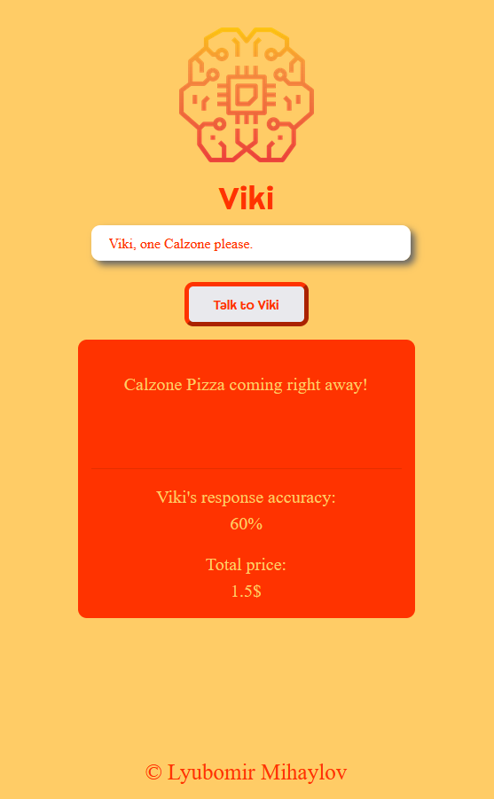

# Fast food chatbot - Viki
Chatbot that operates inside the fast food domain.

## How it works:

1. Viki takes user input.
2. Traverse a dictionary with inputs that she is familiar with and responds with approriate answer(Question : Answer), using Levenshtein distance between the user input and her closest guess. That way the user may not type the exact question and will still be understood.
3. Temporary dictionary is created storing the best answers, picked from step 2, correspoding with their Levenshtein ratios. ( Answer : Ratio ).  
4. Select the answer with the highest ratio and display it to the user, while also calculating total price in the process.

## Prerequisets:
- Flask
- Python >= 3.7
- Anaconda

## Setup and run:
1. Unzip the archive\clone the repo
2. Open terminal\command prompt inside the repo folder.
3. `conda create -n viki-chatbot`
4. `conda activate`
5. `export FLASK_APP=main.py` (Unix system) \ `set FLASK_APP=main.py` (Windows system)
6. `flask run`
7. Go to browser and type `localhost:5000` in address bar.
8. Chat