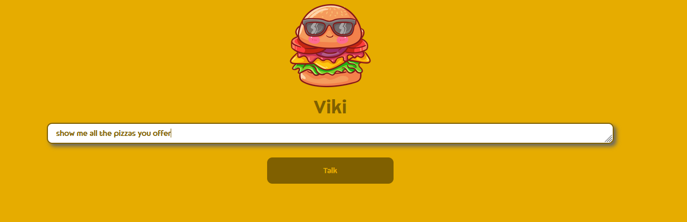

# Fast food chatbot - Viki

Chatbot that operates inside the fast food domain.

## How it works:

How does Viki works
1. Viki takes user input
2. The input is splitted into tri-grams and then the prefixes and suffix are stored in seperate columns in autocomplete spredsheet.
   The spreadsheet is accessed and rows from it retreived on every captured button press event, implementing an autocomplete mechanism.
4. Extract the topic and stores it for topic analysis, that could be performed, based on accumulated topics over time.
5. Uses multi-class classification model to determine the intent of the user. The intent falls into one of the following categories:
  - "Show all products"
  - "Show specific product"
  - "Show product category"
  - "Order product"
  - "Other"
6. If the recognized intent is "Order product", Viki determines the count of the desired product in the user input and adds the respective record number in the final receipt document. ("I want to order 3 calzones please" -> 3 rows of calzone added to receipt) 
    If the recoginzed intent is "Show specific products", image of the mentioned product in the input, along with ingredients information is shown.
    If the recoginzed intent is "Show all products", every image of every product that Viki offers is shown.
    If the recoginzed intent is "Show product category", images of the mentioned product category is shown.
    If the recoginzed intent is "Other", Viki will respond, according to her knowledge base about topics, different from the domain.

7. If the intent is related to ordering a product, then the chatbot performs the following:
  7.1 Traverse a dictionary with inputs that she is familiar with and responds with approriate answer(Question : Answer), using Levenshtein distance between the user input and her closest guess. That way the user may not type the exact question and will still be understood.
  7.2 Temporary dictionary is created storing the best answers, picked from step 2, correspoding with their Levenshtein ratios. (Answer : Ratio)  
  7.3 Select the answer with the highest ratio and display it to the user, while also calculating total price in the process.

8. After the user orders the product he wants, clicking the "Generate receipt" button will build receipt pdf doc, which could be then downloaded by the user.

# Screenshots
![Order X number of [product]](flaskr/static/viki_demo_1.PNG)

## Prerequisets:
- Flask
- Python >= 3.7
- Anaconda
- NLTK (AveragedPerceptronTagger and PunktSentenceTokenizer) 

## Setup and run:
1. Unzip the archive\clone the repo
2. Open terminal\command prompt inside the repo folder.
3. `conda create -n viki-chatbot`
4. `conda activate`
5. `export FLASK_APP=flaskr/main.py` (Unix system) \ `set FLASK_APP=flaskr/main.py` (Windows system) (Terminal: `$env:FLASK_APP="flaskr/main.py"`) 
6. `flask run`
7. Go to browser and type `localhost:5000` in address bar.
8. Chat